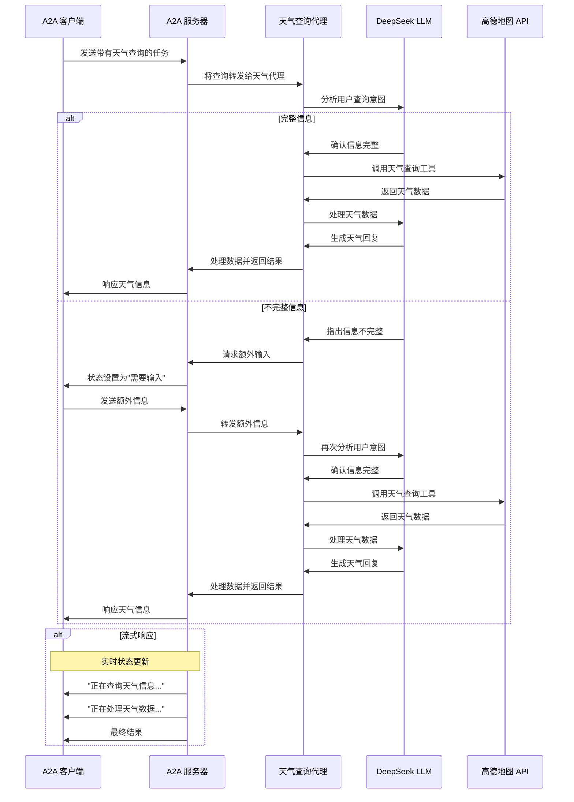

# 基于 A2A 协议的天气查询代理
本示例展示了一个使用 A2A 协议构建的天气查询代理。它支持多轮对话交互和流式响应，为用户提供实时的天气信息查询服务。

## 工作原理
该代理通过高德地图 API 提供天气信息查询服务。A2A 协议使客户端能够以标准化的方式与代理交互，发送请求并接收实时更新。

## 主要特点
- 多轮对话 : 代理可以在需要时请求额外信息
- 实时流式响应 : 在处理过程中提供状态更新
- 推送通知 : 支持基于 webhook 的通知
- 对话记忆 : 在交互过程中维持上下文
- 天气查询工具 : 集成高德地图 API 获取实时天气数据

## 前提条件
- Python 3.13 或更高版本
- UV
- 高德地图 API 密钥